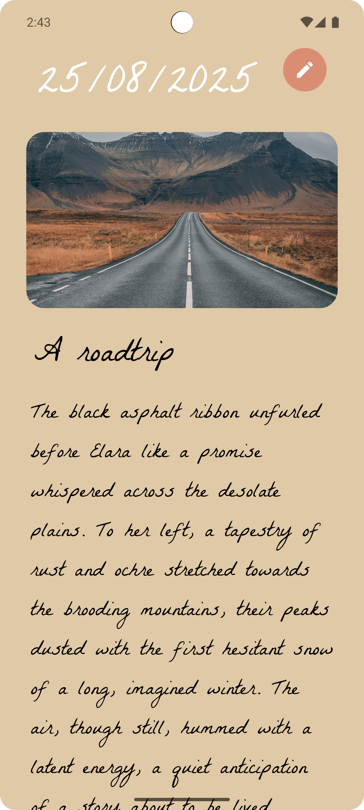

# Deary: A Daily Diary App ✍️

**Deary** is a simple and elegant Android application that works like a personal digital diary. It allows users to capture their daily memories with a date, title, description, and an optional photo. All entries are stored locally on the device for privacy and can be easily viewed, updated, or deleted.

***

## ✨ Features

* **Create Entries**: Make new diary entries with a title, description, and an optional photo of the day.
* **View Notes**: See all your diary entries displayed in a beautiful grid format on the home screen.
* **Update & Delete**: Easily edit or remove old notes.
* **Search**: Find specific entries by searching for keywords in the title or description, or filter by a specific date.
* **Local Storage**: All data is stored securely on your device using SQLite, ensuring your personal thoughts remain private.

***

## 📸 Screenshots

### Home Screen
This is the main screen of the app, displaying all your diary entries. The date at the top shows the current day.
<div align="center">
  
  
</div>

### View Each Entry
This screen shows you the diary entry for a particular day.
<div align="center">
  
  
</div>

### Adding a New Entry
This screen allows you to create a new diary entry. You can add a title, description, and a photo from your camera or gallery.
<div align="center">
  
  
  
</div>

### Search Functionality
You can search for notes by title, description, or date from a dedicated search screen.
<div align="center">
  
  
</div>

### Long-Press to Delete
Long-pressing an entry on the home screen activates a delete mode, allowing you to easily remove notes.
<div align="center">
  
  
</div>

### Update Entry
Going into the entry and clicking on the pencil icon lets you update the entry.
<div align="center">
  
</div>

***

## 🛠️ Built With

* **Kotlin**: The primary programming language for Android development.
* **Android SDK**: The official development kit for building Android apps.
* **SQLite**: A lightweight, file-based database used for local data storage.
* **Material Design**: For a clean and modern user interface.

***

## 🚀 Getting Started

To get a local copy of the project up and running, follow these simple steps.

### Prerequisites
* Android Studio
* A physical Android device or emulator running Android 6.0 (Marshmallow) or higher.

### Installation
1. Clone the repository:
   ```bash
   git clone [https://github.com/your-username/Deary.git](https://github.com/your-username/Deary.git)
2. Open the project in Android Studio.

3. Build and run the app on your device or emulator.

